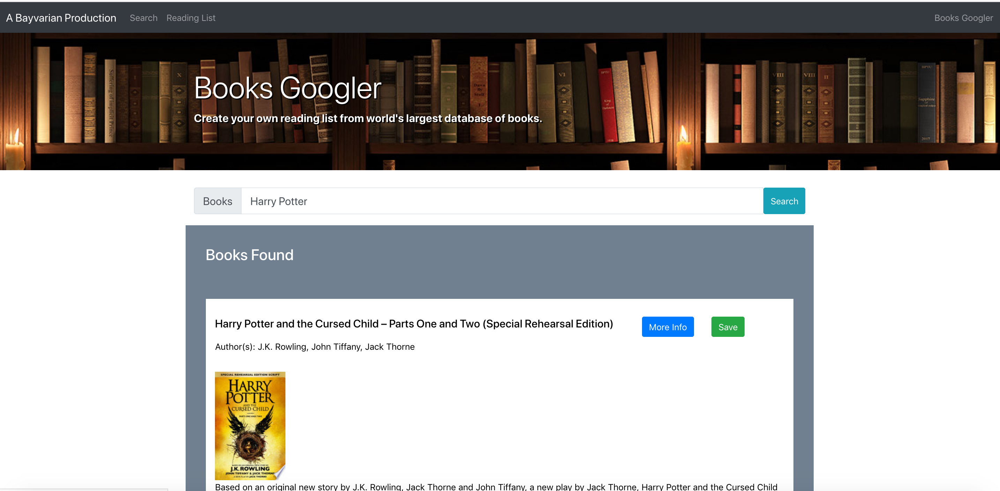
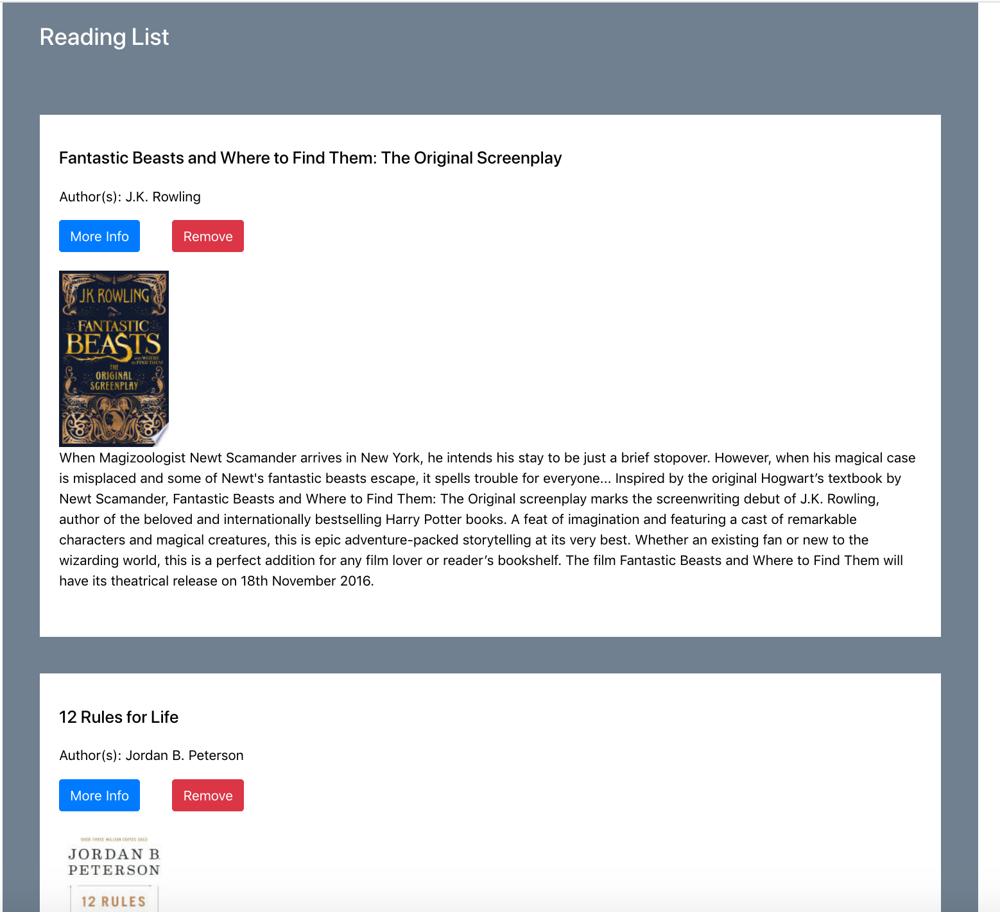

# HW15 | Google Books Search
## React.js Full Stack Web App

## Link to Live Deployed Page on Heroku
[Heroku Deployed App](https://enigmatic-inlet-11756.herokuapp.com/)

## Installation/Usage
* npm install for initial download of dependent packages
* npm start to init server
* navigate to localhost:3000 in web browser to launch app

### App Screenshots
* Main Page

* Reading List Page

### Technologies Used
* Node.JS 
* Express
* React
* Javascript ES6
* jQuery
* Bootstrap
* MongoDB
* Mongoose

### Comments
* Added edge case to prevent dupe saves
* Add edge case for no empty reading list 
* fully mobile responsive